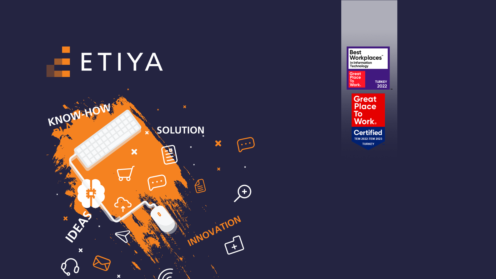

# Etiya Academy E-Commerce Project :tada:

 
 Etiya Academy 5th Term team joint project 

 
 

## Build With

 

## Technologies, Tools And Techniques Used

- Java
- Spring Boot
- N-Tier Architecture
- JPA/Hibernate
- Maven
- Lombok
- PostgreSQL

## Contributing
Contributions are what make the open source community such an amazing place to be learn, inspire, and create. Any contributions you make are greatly appreciated.

1. Fork the Project
2. Create your Feature Branch (`git checkout -b f/AmazingFeature`)
3. Commit your Changes (`git commit -m 'Add some AmazingFeature'`)
4. Push to the Branch (`git push origin f/AmazingFeature`)
5. Open a Pull Request

## Contact

Project Link: https://github.com/Furkan394/e-commerce-demo-pair-7

## Acknowledgment

<a href="https://github.com/engindemirog">🙏engindemirog</a>  
<a href="https://github.com/halitkalayci">🙏halitkalayci</a>  
<a href="https://github.com/iremcibal">🙏iremcibal</a>
